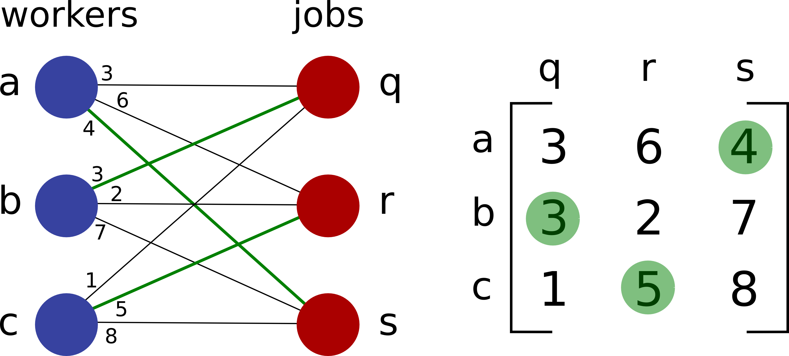

# A Fortran solver for the Linear Assignment Problem (LAP)

## Description

The [Linear Assignment Problem](https://en.wikipedia.org/wiki/Assignment_problem) (LAP) is a fundamental combinatorial optimization problem with broad applications. It can be described in the following way: there is *n* available workers  and *n* jobs to perform. Each worker can perform only one job and there is a cost associated for each worker to do a particular job. An example of this problem is illustrated below:

The aim is to find the optimal assignment *i.e.* the assignment that minimize the overall cost. A possible assignment (which is not the optimal one) is illustrated here. The optimal assignment for this particular example is to assign worker *a* to job *s*, worker *b* to job *r* and worker *c* to job *q* for an overall cost of 7. The problem is completely defined by the cost matrix that contains all the cost associated with each worker doing each job.

This code is a fortran 90 solver for the LAP that implements two different methods to solve the problem:

* The first one is a brute force method that simply computes all the possibilities (*i.e* all the permutations) using Heap's algorithm. This method is efficient for small matrices but of course scales very badly when the dimension *n* of the cost matrix increases. Actually the time complexity is basically *O(n!)* since the number of permutations to compute is *n!*. This method cannot really be used for *n* larger than 12.

* The second method uses the Munkres' algorithm (also called the [Hungarian algorithm](https://en.wikipedia.org/wiki/Hungarian_algorithm)) to solved the problem. The Munkres' algorithm (*Algorithms for Assignment and Transportation Problems*, J. Munkres, *Journal of the Society for Industrial and Applied Mathematics*, **5**, 1, (1957)) gives the optimal solution with a polynomial time complexity. The particular implementation used here is described in details [here](http://csclab.murraystate.edu/%7Ebob.pilgrim/445/munkres.html) and has a time complexity of *O(n3)*.

## Usage

This program can be compiled using standard fortran compiler by running for example:

`gfortran -O3 lap.f90 -o lap.exe`

The program needs an input file called **lap.in** that contains all the important
parameters and has the following format:

    n gen method mode
    C(1,1) . . C(1,n)
      .           .
      .           .
    C(n,1) . . C(n,n)

with

* *n* the dimension of the cost matrix *C*

* *gen* an integer associated with the generation of *C*
   * *gen* = 0: read *C* in file
   * *gen* = 1: randomly generate *C* as a (*n* x *n*) matrix with integer element in [0,9]
   * *gen* = -1: generate *C* as a 'worst case matrix' *i.e.* *C(i,j) = i * j*

* *method* an integer associated with the algorithm used to find the solution
   * *method* = 1: brute force method (Heap algo)
   * *method* = 2: Munkres algorithm

* *mode* = 0: minimize overall cost, *mode* = 1: maximize overall cost

* And *C(i,j)* are the elements of the cost matrix *C*

Let us note that the LAP problem and the program can be easily generalized to cases where there are *n* workers and *m* jobs *i.e.* to rectangular cost matrices. However we restrain ourselves to the case of square cost matrices here.

## Copyright

Copyright (C) 2017 Fabien Brieuc
